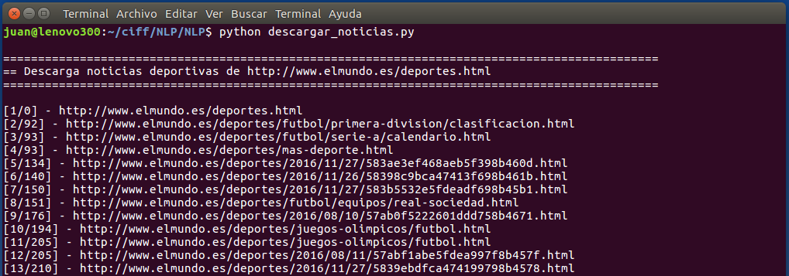

# CLASIFICADOR DE DOCUMENTOS
- Autor: Juan Antonio García Cuevas
- Fecha: noviembre 2016
***

## Descripción:
**Conjunto de scripts que permiten descargar un conjunto de documentos de internet, generar un corpus y crear y entrenar un clasificador de noticas**:

- descargar_noticias.py
- generar_corpus.py
- entrenar_clasificador.py
- clasificar_documentos.py
- pylib.py

## Ejecución:
**Ejecutar los 4 primeros scripts anteriores en orden de aparición**:

1. descargar_noticias.py
2. generar_corpus.py
3. entrenar_clasificador.py
4. clasificar_documentos.py

> NOTA: No se ha subido ningún fichero de datos al repositorio, porque pueden obtenerse ejecutando los propios scripts.

> NOTA: La clasificación incorrecta de algunos documentos puede deberse a que no pertenezca a ninguna de las categorías catalogadas (ajedrez, béisbol...).


***
# Script: descargar_noticias.py

- Este script descarga noticias deportivas de Internet, extrae su información y la almacena en disco.
    - Url de descargas: _http://www.elmundo.es/deportes.html_
    - Directorio de grabación: _./elmundo/deportes/_
    - Formato de ficheros grabados en disco: _JSON_

- Del docuemnto HTML de cada noticia descargada se extrae, entre otra, la siguiente información:
    - título
    - sumario
    - texto de la noticia
    - keywords
    - ...

- A cada noticia descargada se asigna un categoría, extraída de de las keywords del documento HTML original. Las categorías tratadas son las siguientes:
    - FUTBOL
    - TENIS
    - GOLF
    - CICLISMO
    - ATLETISMO
    - BOXEO
    - MOTOCICLISMO
    - BALONCESTO
    - BALONMANO
    - NATACION
    - FORMULA1
    - OLIMPIADAS

    

***
# Script: generar_corpus.py

- Este script genera un corpus de noticas deportivas a partir de las noticias descargadas y guardadas en disco con el script anterior (_descargar_noticias.py_).

- El texto de cada noticia es tratado de la siguiente forma:
    - Se pasa el texto a mayúsculas
    - Se reemplazan las letras acentuadas
    - Se eliminan los signos de puntuación
    - Se eliminan los tokens numéricos
    - Se eliminan las stop words
    - Se eliminan los tokens que no contengan al menos una letra
    - Se reducen los tokens a su raíz mediante el algoritmo Snowball

- Por cada noticia se genera un fichero TXT en el directorio _./mycorpus_, con la lista de tokens resultantes y la categoría a la que pertenece. El nombre del fichero contiene al inicio el identificador de la categoría a la que pertenece.

- Durante este proceso, las noticias a las que no se ha podido asignar una categoría a través de los keywords, se mueven al directorio _./elmundo/deportes/sinclasificar/_, para poder ser clasificadas posteriormente una vez obtenido el clasificador.

    
    

***
# Script: entrenar_clasificador.py

- Este script crea y entrena un clasificador de documentos a partir del corpus previamente generado y guardado en disco por el script anterior (_generar_corpus.py_).

- Se ha utilizado un clasificador bayesiano ingenuo (NaiveBayesClassifier), un clasificador de aprendizaje supervisado (deduce una función a partir de datos de entrenamiento, como ejemplos ya clasificados) que, dado un nuevo ejemplo, nos permite cuantificar la probabilidad de ocurrencia de una hipótesis.

- El clasificador entrenado es almacenado en disco en el fichero _my_classifier.pickle_.

    

***
# Script: clasificar_documentos.py

- Este script lee documentos de noticias sin clasificar y aplica el clasificador para intentar determinar a qué categoría pertenece.

    

- Se adjunta el fichero _out_clasificados.txt_ con el resultado de la clasificación de 300 noticias que no han formado parte del entrenamiento del clasificador.


- Algunos ejemplos de clasificación:

```
=== CICLISMO ============================
- keywords: deportes,Tour de Francia,Alejandro Valverde,Movistar
- fichero.: ./elmundo/deportes/sinclasificar/5786681e468aeb8c4b8b459f.json
- titulo..: Vendaval de Sagan y nuevo despiste de Nairo Quintana
- summary.: El eslovaco vence en Montpellier y sólo Froome le siguió el ritmo hasta el final.. Clasificación Etapa 11 - Tour de Francia 2016

=== CICLISMO ============================
- keywords: deportes,Rally Dakar
- fichero.: ./elmundo/deportes/sinclasificar/56981417268e3e86078b46d3.json
- titulo..: Peterhansel y Price, cerca de la gloria
- summary.: 'Monsieur Dakar' domina con 51:55 de margen sobre Al Attiyah, mientras el australiano de KTM aventaja en 35:23 a Svitko

=== FORMULA1 ============================
- keywords: deportes,Rally Dakar,Stéphane Peterhansel,Carlos Sainz
- fichero.: ./elmundo/deportes/sinclasificar/569a4316268e3e1c5d8b4577.json
- titulo..: Peterhansel sigue siendo 'Monsieur Dakar'
- summary.: El piloto francés completó la última etapa en un tiempo de 1h 54m 28s. Con éste, el especialista de Peugeot, suma seis títulos en motos y seis en autos

=== FORMULA1 ============================
- keywords: deportes,Rally Dakar
- fichero.: ./elmundo/deportes/sinclasificar/5694100a268e3e72028b4593.json
- titulo..: Un accidente acaba con el Dakar de Loeb
- summary.: El francés da varias vueltas de campana y pierde más de una hora en la general. Al Attiyah, por delante de Sainz y Peterhansel, gana la primera etapa para Mini

=== TENIS ============================
- keywords: deportes,US Open
- fichero.: ./elmundo/deportes/sinclasificar/57c075a8e2704e6f228b45ba.json
- titulo..: Nadal debuta ante Istomin en NY y comparte cuadro con Djokovic
- summary.: El español se mediría al número uno en un hipotético duelo de semifinales

=== TENIS ============================
- keywords: deportes,política - partidos,Roger Federer,Roma,objetivo,Masters 1000
- fichero.: ./elmundo/deportes/sinclasificar/57334e4322601d5e278b4686.json
- titulo..: Federer, peligro en Roma
- summary.: "No sé si jugaré mañana, depende de cómo esté y lo decidiré paso a paso. Espero que sí", dijo el suizo tras ganar en su debut. Novak Djokovic y Andy Murray pasaron a la segunda ronda tras vencer a Stephane Robert y Mikhail Kukushkin

=== BALONCESTO ============================
- keywords: deportes,NBA,Golden State Warriors,Pau Gasol
- fichero.: ./elmundo/deportes/sinclasificar/56922376268e3e491d8b45ff.json
- titulo..: Stephen Curry vuelve a exhibirse
- summary.: El base de los Warriors dejó 38 puntos, 11 asistencias y 8 triples. Los Hawks vencieron a los Bulls de Pau y Mirotic, que hizo un partidazo

=== OLIMPIADAS ============================
- keywords: deportes,deporte - eventos deportivos - campeonato mundial,Mireia Belmonte,piscina
- fichero.: ./elmundo/deportes/sinclasificar/56573fb522601d8f658b4624.json
- titulo..: Mireia Belmonte está de vuelta: 'No ha ganado ni un gramo'
- summary.: Fred Vergnoux, entrenador de Mireia Belmonte, analiza el regreso a la competición de la nadadora antes del campeonato de España en piscina corta

=== OLIMPIADAS ============================
- keywords: deportes,disturbios, conflictos y guerra - guerra,Anni Espar,España,Rusia,Laura López,encuentro,gol
- fichero.: ./elmundo/deportes/sinclasificar/569fc6f1ca4741fe5f8b4667.json
- titulo..: Una lección de carácter conduce a España a las semifinales del Europeo
- summary.: Vence con contundencia a Rusia tras un arranque dubitativo y luchará por las medallas (8-12). El oro clasifica para los JJOO

```

***
# Script: pylib.py

- Este script contiene algunas funciones de utilidades enpleadas en los scripts anteriores.

***
